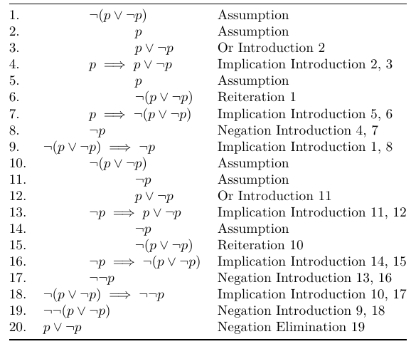
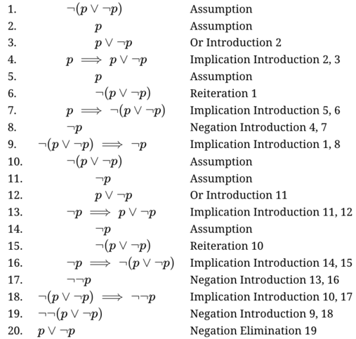

# pandoc-logic-proof

A pandoc filter for writing and formatting logic proofs.

Output examples and instructions on how to use the program are
included in the [tutorial](tutorial.pdf).

Sample PDF output:



Sample HTML output for the same proof:



The markdown that produced them:

    ```{.logicproof}
    10  | | $\lnot (p \lor \lnot p)$ | Assumption
    20  | | | $p$ | Assumption
    30  | | | $p \lor \lnot p$ | Or Introduction (@20)
    40  | | $p \implies p \lor \lnot p$ | Implication Introduction (@20), (@30)
    50  | | | $p$ | Assumption
    60  | | | $\lnot (p \lor \lnot p)$ | Reiteration (@10)
    70  | | $p \implies \lnot (p \lor \lnot p)$ | Implication Introduction (@50), (@60)
    80  | | $\lnot p$ | Negation Introduction (@40), (@70)
    90  | $\lnot (p \lor \lnot p) \implies \lnot p$ | Implication Introduction (@10), (@80)
    100 | | $\lnot (p \lor \lnot p)$ | Assumption
    110 | | | $\lnot p$ | Assumption
    120 | | | $p \lor \lnot p$ | Or Introduction (@110)
    130 | | $\lnot p \implies p \lor \lnot p$ | Implication Introduction (@110), (@120)
    140 | | | $\lnot p$ | Assumption
    150 | | | $\lnot (p \lor \lnot p)$ | Reiteration (@100)
    160 | | $\lnot p \implies \lnot (p \lor \lnot p)$ | Implication Introduction (@140), (@150)
    170 | | $\lnot \lnot p$ | Negation Introduction (@130), (@160)
    180 | $\lnot (p \lor \lnot p) \implies \lnot \lnot p$ | Implication Introduction (@100), (@170)
    190 | $\lnot \lnot (p \lor \lnot p)$ | Negation Introduction (@90), (@180)
    200 | $p \lor \lnot p$ | Negation Elimination (@190)
    ```

