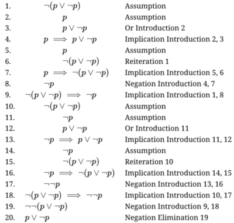

# pandoc-logic-proof

A pandoc filter that provides a Markdown extension for logic proofs.
A [**tutorial**](tutorial.pdf) is available.

|  PDF sample  |  HTML sample  |
|:------------:|:-------------:|
|  |  |


## Quick start

If you already know how to use cabal packages or Nix flakes,
and how to use Pandoc filters, you can skip directly to the
[**tutorial**](tutorial.pdf).

## Installation

This package is available from Hackage, or as a Nix flake.

### From Hackage

To install from Hackage, use [cabal install](https://cabal.readthedocs.io/en/stable/cabal-commands.html#cabal-install).
The package name is `pandoc-logic-proof`.

### In a Nix shell

Note: Flakes must be [enabled](https://nixos.wiki/wiki/Flakes) in your Nix or NixOS installation.

One way to use the Nix flake is to create a `shell.nix` with pandoc and this package, like so:

~~~
with (import <nixpkgs> {});
let
  pandoc-include-plus = (builtins.getFlake git+https://codeberg.org/mhwombat/pandoc-include-plus).packages.${builtins.currentSystem}.default;
in
mkShell {
  buildInputs = [
    pandoc
    pandoc-logic-proof
    # add any other software you want to use in the shell.
  ];
}
~~~

Enter the shell using `nix-shell`, and this package will be available for use.

### In a Nix flake

Add this package to your `flake.nix`:

```nix
{
  inputs.pandoc-logic-proof.url = "github:mhwombat/pandoc-logic-proof";

  outputs = { self, pandoc-logic-proof }: {
    # Use in your outputs
  };
}

```

## Usage

The [**tutorial**](tutorial.pdf) explains how to write proofs using the Markdown
syntax extensions provided by this filter.
Then, you can format your document either using pandoc directly,
or through Hakyll.

### With Pandoc

Use this filter by adding `--filter=pandoc-logic-proof` to your pandoc command.
For example:

    pandoc --filter=pandoc-logic-proof myfile.md --output=myfile.pdf

The tutorial was produced using the command:

    pandoc --filter=pandoc-logic-proof tutorial.md --output=tutorial.pdf

### With Hakyll

Use this filter as a transform in Hakyll.
For example, you could modify `site.hs`, adding

```
import Text.Pandoc.Filters.LogicProof (transform)
```

and changing

```
pandocCompiler
```

to

```
pandocCompilerWithTransform defaultHakyllReaderOptions defaultHakyllWriterOptions transform
```

